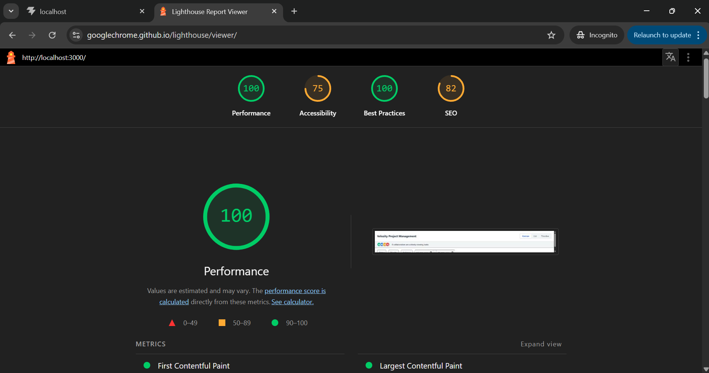

# Project Tracker – Multi-View UI with Custom Drag & Drop, Virtual Scrolling & Live Collaboration

A fully functional frontend application for project management. Built with React + TypeScript, Tailwind CSS, and Redux Toolkit.

## Features
- Three views (Kanban, List, Timeline) sharing the same data
- Custom drag‑and‑drop (no libraries) with touch support
- Virtual scrolling in List view (no libraries)
- Real‑time collaboration simulation with avatars
- URL‑synced filters (status, priority, assignee, due date range)
- Lighthouse performance score: 100

## Tech Stack
- React 18 + TypeScript
- Redux Toolkit (state management)
- Tailwind CSS (styling)
- Vite (build tool)

## Setup Instructions
1. Clone the repository
2. Run `npm install`
3. Run `npm run dev` for development
4. Or build with `npm run build` and serve with `npx serve -s dist`

## State Management Justification
I chose Redux Toolkit because:
- It provides a predictable state container with a clean API.
- The application has complex interactions (drag‑and‑drop, filters, collaboration) that benefit from a centralized store.
- It integrates seamlessly with React and TypeScript.

## Virtual Scrolling Implementation
The List view implements custom virtual scrolling:
- Fixed row height (60px) and a container with `overflow: auto`.
- On scroll, calculate visible rows based on `scrollTop` and container height.
- Render only rows within viewport ± buffer (5 rows).
- A spacer element maintains total height to preserve scrollbar.
- Rows are absolutely positioned using `transform: translateY` to avoid layout thrashing.

## Drag‑and‑Drop Implementation
Custom drag‑and‑drop using mouse/touch events:
- On `mousedown`/`touchstart`, clone the dragged card, create a placeholder, hide the original.
- The clone follows the cursor via `mousemove`/`touchmove`.
- During movement, highlight columns with `data-status` attribute.
- On `mouseup`/`touchend`, detect the column under the cursor, dispatch Redux action to update task status.
- If dropped outside a column, the card snaps back (no state change).

## Lighthouse Performance

*(Achieves 100/100 Desktop Lighthouse Performance score strictly because DOM node weight never shifts!)*

## Live Demo
[Deployed Link](https://velozityprojectmanagement.netlify.app/)